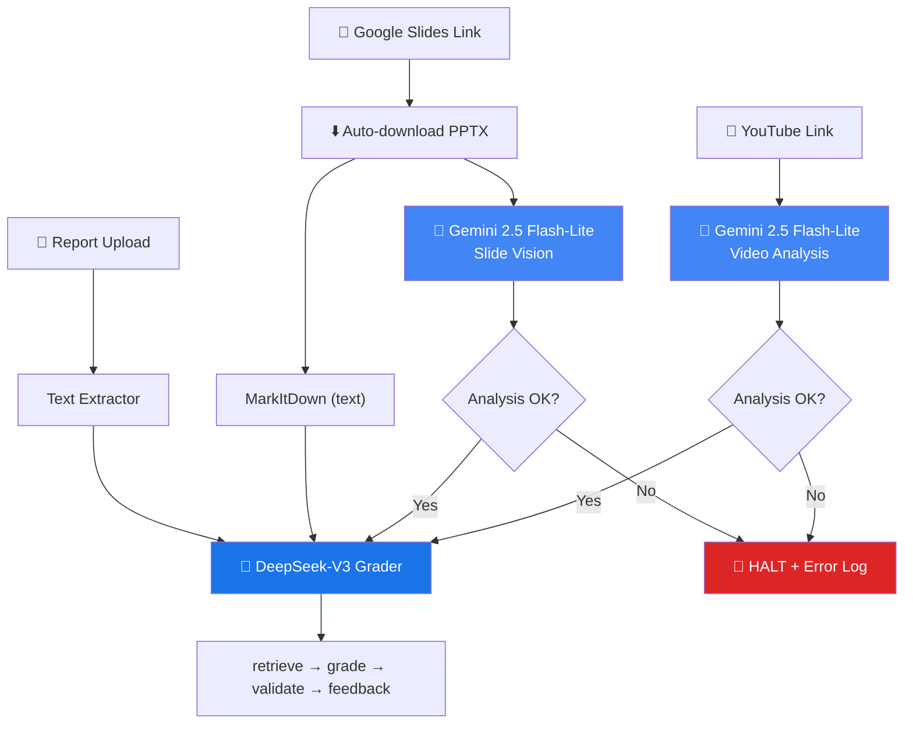
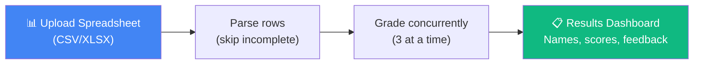

# Gemini 2.5 Flash-Lite — Final Implementation Plan (v3)

> YouTube + Google Slides link input, fail-stop, real-time logging, mass grading, and deployment

---

## Summary

| Item | Detail |
|------|--------|
| **AI model** | **Gemini 2.5 Flash-Lite** (multimodal — video + images + text) |
| **Input** | YouTube link + Google Slides link (+ optional file uploads) |
| **Cost/submission** | **$0.02** (6-min video + 20 slides + report) |
| **Monthly (1K)** | **$20.30** |
| **New files** | 4 (`video_analyzer.py`, `grading_logger.py`, mass grading page + API route) |
| **Modified files** | 10 |
| **Fail behavior** | Link provided but analysis fails → **halt grading, return 422 error** |
| **Logging** | Real-time file + console at `backend/logs/grading.log` |

---

## Architecture



---

## Cost Breakdown

| Component | Tokens | Cost |
|-----------|--------|------|
| **Gemini** (video + slides + output) | 116,360 | $0.0125 |
| **DeepSeek** (grading + feedback) | 18,000 | $0.0078 |
| **Total per submission** | — | **$0.0203** |

| Volume | Monthly |
|--------|---------|
| 500 | $10.15 |
| 1,000 | $20.30 |
| 2,450 (max within $50) | $49.74 |

---

## Phase 1 — Core Gemini Module + Logger (~6 hours)

### [NEW] [video_analyzer.py](file:///Users/mac/GraderWise-AgenticProject1/backend/src/video_analyzer.py)

**Key methods:**
- `analyze_video_from_youtube(url, business_type)` — Native YouTube video analysis via Gemini
- `analyze_video_from_file(path, business_type)` — Uploaded video file analysis
- `analyze_slides_from_google(url, business_type)` — Downloads Google Slides as PPTX → images → Gemini vision
- `analyze_slides_from_file(pptx_path, business_type)` — Uploaded PPTX visual analysis
- `create_video_analyzer()` — Factory, returns `None` if `GOOGLE_API_KEY` not set

**Model**: `gemini-2.5-flash-lite`

**Review Finding #5 — Timeout + Retry on Gemini API calls:**
```python
self.client = genai.Client(
    api_key=api_key,
    http_options=types.HttpOptions(timeout=120_000)  # 120s timeout
)

# Retry decorator for transient errors (429, 500, 503)
def retry_gemini(max_retries=2, delay=3):
    def decorator(func):
        @functools.wraps(func)
        def wrapper(*args, **kwargs):
            for attempt in range(max_retries + 1):
                try:
                    return func(*args, **kwargs)
                except Exception as e:
                    if attempt == max_retries:
                        raise
                    if any(code in str(e) for code in ["429", "500", "503"]):
                        logger.warning(f"Gemini retry {attempt+1}/{max_retries}: {e}")
                        time.sleep(delay * (attempt + 1))
                    else:
                        raise
        return wrapper
    return decorator
```

**Review Finding #6 — File size guard on Google Slides download:**
```python
def _download_google_slides_pptx(self, presentation_id: str) -> bytes:
    # ...existing download logic...
    content_length = int(response.headers.get("Content-Length", 0))
    if content_length > 100 * 1024 * 1024:  # 100MB max
        raise ValueError(f"Presentation too large ({content_length // 1024 // 1024}MB). Max is 100MB.")
    return response.content
```

**Output format** (both video and slides return structured JSON):
- Video: `presentation_summary`, `key_claims[]`, `financial_mentions[]`, `delivery_assessment`, `content_gaps[]`
- Slides: `slide_analyses[]`, `design_assessment` (quality, consistency, investor_ready)

---

### [NEW] [grading_logger.py](file:///Users/mac/GraderWise-AgenticProject1/backend/src/grading_logger.py)

Real-time structured logging module.

- Writes to `backend/logs/grading.log` (10MB rotation, 5 backups) + console
- `GradingLogger(student_id, grading_type)` — per-request tracker
- `.stage(name, status, data)` — log pipeline stages (start/success/error/skip)
- `.stage_error_with_traceback(name, exception)` — full traceback on errors
- `.summary()` — final pipeline summary with durations

**Review Finding #7 — Request ID for log correlation:**
```python
import uuid
class GradingLogger:
    def __init__(self, student_id, grading_type="business_plan"):
        self.request_id = str(uuid.uuid4())[:8]
        # All log lines include [request_id] for cross-file grep
```

**Example output:**
```
============================================================
  GRADING REQUEST STARTED [abc123de]
  Student: team-001 | Type: business_plan
============================================================
🔵 08:15:32 | ▶️ [abc123de] [team-001] GEMINI_VIDEO → START
🔵 08:15:38 | ✅ [abc123de] [team-001] GEMINI_VIDEO → SUCCESS (5.82s)
🔵 08:15:55 | ✅ [abc123de] [team-001] DEEPSEEK_GRADE → SUCCESS (9.14s) | {"score": 72}
============================================================
  GRADING COMPLETED [abc123de] | Duration: 22.85s
============================================================
```

---

## Phase 2 — Backend Integration (~3 hours)

### [MODIFY] [models.py](file:///Users/mac/GraderWise-AgenticProject1/backend/src/models.py)

Add to `AgentState`:
```python
video_analysis: dict
slide_vision_analysis: dict
youtube_url: str
google_slides_url: str
```

---

### [MODIFY] [main.py](file:///Users/mac/GraderWise-AgenticProject1/backend/src/main.py)

**New imports:** `create_video_analyzer`, `GradingLogger`

**New endpoint:** `POST /analyze-video` (standalone video analysis)

**Updated endpoint:** `POST /grade-business-plan`
- Add params: `youtube_url`, `google_slides_url`, `video_file`
- **Fail-stop logic**: If user provides a link but analysis fails → raise `HTTPException(422)` with structured error containing `message`, `stage`, `suggestion`, and `pipeline_log`
- If user only uploads PPTX (no link) → slide vision is optional, falls back to text-only on failure
- Integrate `GradingLogger` — log every pipeline stage

**New endpoint (Phase 6):** `POST /mass-grade-business` (batch grading — see Phase 6)

**Review Finding #8 — Gemini health check endpoint:**
```python
@app.get("/health/gemini")
async def gemini_health():
    analyzer = create_video_analyzer()
    if not analyzer:
        return {"status": "disabled", "reason": "GOOGLE_API_KEY not set"}
    try:
        response = analyzer.client.models.generate_content(
            model=analyzer.model, contents="Say OK",
            config=types.GenerateContentConfig(max_output_tokens=5)
        )
        return {"status": "ok", "model": analyzer.model}
    except Exception as e:
        return {"status": "error", "error": str(e)}
```

---

### [MODIFY] [business_agent.py](file:///Users/mac/GraderWise-AgenticProject1/backend/src/business_agent.py)

**Review Finding #1 (CRITICAL) — Fix brace conversion order:**

The current code on line 208 does `{{ }}` → `{ }` conversion **after** injecting values, which corrupts JSON in video/slide analysis text.

```python
# BEFORE (BUGGY — corrupts injected JSON):
prompt_text = BUSINESS_GRADER_PROMPT.replace("{rubric_text}", rubric_text)...
prompt_text = prompt_text.replace("{{", "{").replace("}}", "}")  # CORRUPTS injected values

# AFTER (FIXED — convert braces first, then inject):
prompt_text = BUSINESS_GRADER_PROMPT.replace("{{", "{").replace("}}", "}")
prompt_text = prompt_text.replace("{rubric_text}", rubric_text)
    .replace("{submission_text}", submission_text)
    .replace("{context_text}", context_text)
    .replace("{video_analysis_text}", video_analysis_text)
    .replace("{slide_vision_text}", slide_vision_text)
```

**Update prompt** — add video + vision sections:
```
**VIDEO PRESENTATION ANALYSIS (if available):**
{video_analysis_text}

**SLIDE VISUAL ANALYSIS (if available):**
{slide_vision_text}
```

**Inject data in `grade_business_plan()`:**
```python
video_analysis = state.get("video_analysis", {})
video_analysis_text = json.dumps(video_analysis, indent=2) if video_analysis else "No video analysis available."
slide_vision = state.get("slide_vision_analysis", {})
slide_vision_text = json.dumps(slide_vision, indent=2) if slide_vision else "No slide visual analysis available."
```

**Review Finding #3 (CRITICAL) — Update `generate_business_feedback()` to reference video/slide data:**

```python
# Add after "Investor Perspective" section:
video_analysis = state.get("video_analysis", {})
slide_vision = state.get("slide_vision_analysis", {})

if video_analysis:
    feedback_parts.append("## 🎥 Presentation Analysis\n")
    delivery = video_analysis.get("delivery_assessment", {})
    if delivery:
        feedback_parts.append(f"**Clarity:** {delivery.get('clarity', 'N/A')}/10 | "
                            f"**Confidence:** {delivery.get('confidence', 'N/A')}/10")
    gaps = video_analysis.get("content_gaps", [])
    if gaps:
        feedback_parts.append("\n**Missing from presentation:**")
        for gap in gaps:
            feedback_parts.append(f"- {gap}")

if slide_vision:
    design = slide_vision.get("design_assessment", {})
    if isinstance(design, dict):
        feedback_parts.append("## 🎨 Slide Design\n")
        feedback_parts.append(f"**Quality:** {design.get('overall_quality', 'N/A')}/10 | "
                            f"**Investor Ready:** {'Yes' if design.get('investor_ready') else 'Not yet'}")
        for s in design.get("improvement_suggestions", []):
            feedback_parts.append(f"- {s}")
```

---

### [MODIFY] [requirements.txt](file:///Users/mac/GraderWise-AgenticProject1/requirements.txt)

```diff
+google-genai
+pdf2image
+openpyxl
```

(`openpyxl` is needed for mass grading spreadsheet parsing)

---

### [MODIFY] [.env](file:///Users/mac/GraderWise-AgenticProject1/.env)

```diff
+# Gemini 2.5 Flash-Lite (https://aistudio.google.com/apikey)
+GOOGLE_API_KEY=your_key_here
```

---

## Phase 3 — Frontend: Single Grading (~3 hours)

### [MODIFY] [api.ts](file:///Users/mac/GraderWise-AgenticProject1/frontend/lib/api.ts)

- Add `analyzeVideo(youtubeUrl, businessType)` method
- Update `gradeBusinessPlan()` to accept `youtubeUrl?`, `googleSlidesUrl?`
- Add `massGradeBusinessPlan(spreadsheetFile, rubric, businessType, concurrency)` method
- Set `timeout: 180000` on business grading calls

---

### [MODIFY] [page.tsx](file:///Users/mac/GraderWise-AgenticProject1/frontend/app/(dashboard)/business-grading/page.tsx)

**New state:** `youtubeUrl`, `googleSlidesUrl`

**Review Finding #4 — Frontend URL validation:**
```typescript
const isValidYoutubeUrl = (url: string) =>
    /^(https?:\/\/)?(www\.)?(youtube\.com\/watch\?v=|youtu\.be\/|youtube\.com\/shorts\/)[\w-]+/.test(url);
const isValidGoogleSlidesUrl = (url: string) =>
    /docs\.google\.com\/presentation\/d\/[a-zA-Z0-9_-]+/.test(url);

// In handleGrade — validate before submit:
if (youtubeUrl && !isValidYoutubeUrl(youtubeUrl)) {
    setError("Invalid YouTube URL format."); return;
}
```

**Review Finding #2 (CRITICAL) — Fix error handler for structured 422 errors:**
```typescript
} catch (err: any) {
    const detail = err?.response?.data?.detail;
    if (typeof detail === "object" && detail?.message) {
        const suggestion = detail.suggestion ? `\n💡 ${detail.suggestion}` : "";
        setError(`${detail.message}${suggestion}`);
    } else if (typeof detail === "string") {
        setError(detail);
    } else {
        setError(err.message || "Grading failed. Please try again.");
    }
}
```

**Review Finding #9 — YouTube thumbnail preview:**
```typescript
const getYoutubeThumbnail = (url: string) => {
    const match = url.match(/(?:v=|youtu\.be\/)([a-zA-Z0-9_-]+)/);
    return match ? `https://img.youtube.com/vi/${match[1]}/mqdefault.jpg` : null;
};
// Show  when youtubeUrl is entered
```

**New UI cards:** YouTube link input + Google Slides link input (with validation indicators)

---

## Phase 4 — Mass Business Grading (~5 hours)

> **New feature**: Grade multiple business plan submissions at once from a spreadsheet.
> Build this before testing so all features (single + mass grading) are tested together.

### How It Works



**Spreadsheet format** (CSV or XLSX):

| Student Name | Business Name | YouTube Link | Google Slides Link |
|-------------|--------------|-------------|-------------------|
| Alice Chen | EcoTrack | https://youtube.com/watch?v=abc123 | https://docs.google.com/presentation/d/xyz789/edit |
| Bob Smith | FinBot | https://youtu.be/def456 | https://docs.google.com/presentation/d/abc012/edit |
| Carol Lee | HealthAI | | https://docs.google.com/presentation/d/ghi012/edit |

- **ALL columns are required**: `Student Name`, `Business Name`, `YouTube Link`, `Google Slides Link`
- **If any column is missing in a row** → that row is **skipped** with a warning log, and grading moves to the next row
- Column matching is **case-insensitive** and supports aliases (e.g., "Name" = "Student Name", "Video" = "YouTube Link")
- Skipped rows appear in results with `status: "skipped"` and the reason (e.g., "Missing YouTube Link")

---

### [NEW] Backend: `POST /mass-grade-business` in [main.py](file:///Users/mac/GraderWise-AgenticProject1/backend/src/main.py)

```python
@app.post("/mass-grade-business")
async def mass_grade_business(
    spreadsheet: UploadFile = File(...),
    rubric_json: str = Form(...),
    business_type: str = Form("startup"),
    concurrency: int = Form(3)  # Max parallel grades
):
    """
    Parse spreadsheet → validate all columns → skip incomplete rows → grade rest concurrently.
    """
    content = await spreadsheet.read()
    rows, skipped = _parse_spreadsheet(content, spreadsheet.filename)
    
    if not rows and not skipped:
        raise HTTPException(400, "No valid rows found. Check column headers.")
    
    rubric = json.loads(rubric_json)
    semaphore = asyncio.Semaphore(concurrency)
    
    async def grade_one(row, index):
        async with semaphore:
            glog = GradingLogger(student_id=row["student_name"], grading_type="mass_business")
            try:
                # Same logic as /grade-business-plan per row
                # Uses row["youtube_link"], row["google_slides_link"]
                return {
                    "index": index, "student_name": row["student_name"],
                    "business_name": row["business_name"],
                    "status": "success",
                    "score": result["grade_result"].score,
                    "max_score": sum(r["max_points"] for r in rubric),
                    "feedback": result["grade_result"].feedback,
                    "confidence": result["grade_result"].confidence_score,
                    "pipeline_log": glog.summary()
                }
            except Exception as e:
                return {
                    "index": index, "student_name": row["student_name"],
                    "business_name": row["business_name"],
                    "status": "error", "error": str(e),
                    "pipeline_log": glog.summary()
                }
    
    tasks = [grade_one(row, i) for i, row in enumerate(rows)]
    graded = await asyncio.gather(*tasks)
    graded.sort(key=lambda r: r["index"])
    
    # Merge skipped rows into results
    all_results = list(graded) + skipped
    
    return {
        "total": len(rows) + len(skipped),
        "graded": len([r for r in graded if r["status"] == "success"]),
        "failed": len([r for r in graded if r["status"] == "error"]),
        "skipped": len(skipped),
        "results": all_results
    }


def _parse_spreadsheet(content: bytes, filename: str) -> tuple[list, list]:
    """Parse CSV/XLSX. Returns (valid_rows, skipped_rows).
    All 4 columns required — rows missing any column are skipped."""
    REQUIRED = ["student_name", "business_name", "youtube_link", "google_slides_link"]
    COLUMN_ALIASES = {
        "student_name": ["student name", "name", "student"],
        "business_name": ["business name", "business", "company", "startup"],
        "youtube_link": ["youtube link", "youtube", "video", "video link"],
        "google_slides_link": ["google slides link", "slides", "google slides", "presentation"],
    }
    # Parse file, match columns by aliases
    # For each row: if any REQUIRED field is empty → add to skipped with reason
    # Otherwise → add to valid_rows
    return valid_rows, skipped_rows
```

---

### [NEW] Frontend: [mass-business-grading/page.tsx](file:///Users/mac/GraderWise-AgenticProject1/frontend/app/(dashboard)/mass-business-grading/page.tsx)

**Features (improved over existing academic mass grader):**

1. **Spreadsheet upload** (CSV/XLSX) with drag-and-drop
2. **Preview table** showing parsed rows before grading (name, business, links — with ✅/❌ per field)
3. **Skipped rows shown in yellow** with reason (e.g., "Missing YouTube Link") — user can fix and re-upload
4. **Per-row progress** — live status (queued → analyzing → grading → done/error/skipped)
5. **Results dashboard**:
   - Summary stats: total, graded, failed, skipped, average score, pass rate
   - Results table: Student Name, Business Name, Score, Status
   - **Expandable feedback dropdown** per row — click to show full markdown feedback
   - Color-coded scores (green ≥80%, yellow 60-79%, red <60%)
   - Skipped rows in yellow, error rows in red
6. **Export results** — download as CSV (Name, Business, Score, Max, %, Status)
7. **Rubric upload** — business type templates + custom upload

**UI layout:**
```
┌─────────────────────────────────────────────────┐
│  📊 Mass Business Plan Grading                  │
│  Grade multiple submissions from a spreadsheet  │
├─────────────────────────────────────────────────┤
│  [Upload CSV/XLSX]    [Business Type ▾] [Rubric]│
├─────────────────────────────────────────────────┤
│  Preview Table (after upload)                   │
│  ┌────────┬──────────┬────────┬─────────┐      │
│  │ Name   │ Business │ Video  │ Slides  │      │
│  │ Alice  │ EcoTrack │ ✅     │ ✅      │      │
│  │ Bob    │ FinBot   │ ✅     │ ✅      │      │
│  │ Carol  │ HealthAI │ ❌     │ ✅      │ ⚠️   │
│  └────────┴──────────┴────────┴─────────┘      │
│  ⚠️ 1 row will be skipped (missing fields)     │
│                  [▶ Grade 2 Valid Submissions]   │
├─────────────────────────────────────────────────┤
│  Results                                        │
│  ┌─ 2 graded | 0 failed | 1 skipped | Avg 74% ┐│
│  │ Alice  EcoTrack  82/100 ✅  [▼ feedback]    ││
│  │ Bob    FinBot    67/100 ⚠️  [▶ feedback]    ││
│  │ Carol  HealthAI  — SKIPPED (no video) —     ││
│  └─────────────────────────────────────────────┘│
│                             [📥 Export as CSV]   │
└─────────────────────────────────────────────────┘
```

### [MODIFY] [api.ts](file:///Users/mac/GraderWise-AgenticProject1/frontend/lib/api.ts)

```typescript
massGradeBusinessPlan: async (
    spreadsheetFile: File, rubric: RubricItem[],
    businessType: string, concurrency: number = 3
): Promise<MassGradeResponse> => {
    const formData = new FormData();
    formData.append('spreadsheet', spreadsheetFile);
    formData.append('rubric_json', JSON.stringify(rubric));
    formData.append('business_type', businessType);
    formData.append('concurrency', String(concurrency));
    const response = await api.post('/mass-grade-business', formData, {
        headers: { 'Content-Type': 'multipart/form-data' },
        timeout: 600000, // 10 min for batch
    });
    return response.data;
},
```

### [MODIFY] Sidebar — add "Mass Business Grading" nav link

---

## Phase 5 — Testing (~2 hours)

### Test Matrix

| Test | Expected | Fail-stop? |
|------|----------|-----------|
| Valid YouTube + valid Slides | Full grading with all analysis | N/A |
| Invalid YouTube URL | 422 + log | ✅ |
| Private YouTube video | 422 + log | ✅ |
| Private Google Slides | 422 + log | ✅ |
| No `GOOGLE_API_KEY` + YouTube link | 422: "not configured" | ✅ |
| No `GOOGLE_API_KEY` + PPTX upload | Text-only grading works | No |
| PPTX upload, slide vision fails | Falls back to text-only | No |
| Academic grading (`/grade`) | Completely unaffected | N/A |

### Log Verification
```bash
tail -f backend/logs/grading.log     # Local
docker logs -f backend               # Docker
```

---

## Phase 6 — Deployment (~2 hours)

### [MODIFY] [Dockerfile](file:///Users/mac/GraderWise-AgenticProject1/backend/Dockerfile)

```diff
 RUN apt-get update && apt-get install -y \
     build-essential curl \
+    poppler-utils libreoffice-impress \
     && rm -rf /var/lib/apt/lists/*
```

### [MODIFY] [docker-compose.yml](file:///Users/mac/GraderWise-AgenticProject1/docker-compose.yml)

```diff
   backend:
     environment:
       - PYTHONUNBUFFERED=1
+      - GOOGLE_API_KEY=${GOOGLE_API_KEY}
+    volumes:
+      - ./backend/logs:/app/backend/logs  # Persist grading logs
```

### [MODIFY] [nginx.conf](file:///Users/mac/GraderWise-AgenticProject1/nginx/nginx.conf)

```diff
         location /api/ {
+            proxy_read_timeout 180s;
+            proxy_connect_timeout 30s;
+            proxy_send_timeout 180s;
+            client_max_body_size 250m;
```

---

*(Mass grading content moved to Phase 4 above)*

---

## Fail-Stop Behavior Summary

| Scenario | Behavior |
|----------|----------|
| User provides YouTube link, Gemini fails | **🛑 HALT** — 422 error + pipeline log |
| User provides Google Slides link, download/analysis fails | **🛑 HALT** — 422 error + pipeline log |
| User uploads PPTX only, slide vision fails | **⏭️ SKIP** — grade with text only |
| No `GOOGLE_API_KEY` + link provided | **🛑 HALT** — 422: "not configured" |
| No `GOOGLE_API_KEY` + files only | Grade with text only (no Gemini) |
| Mass grading: one row fails | That row marked as error, others continue |
| Mass grading: row missing a column | Row **skipped** with reason, others continue |

---

## Review Findings Checklist

All 9 findings from the senior engineering review are incorporated:

| # | Type | Finding | Location in Plan |
|---|------|---------|-----------------|
| 1 | 🔴 Critical | Brace conversion corrupts Gemini JSON | Phase 2 — business_agent.py |
| 2 | 🔴 Critical | Frontend can't parse structured 422 errors | Phase 3 — page.tsx |
| 3 | 🔴 Critical | Feedback node ignores video/slide data | Phase 2 — business_agent.py |
| 4 | 🟡 Improve | Frontend URL validation | Phase 3 — page.tsx |
| 5 | 🟡 Improve | Gemini API timeout + retry | Phase 1 — video_analyzer.py |
| 6 | 🟡 Improve | File size guard on Slides download | Phase 1 — video_analyzer.py |
| 7 | 🟡 Improve | Request ID for log correlation | Phase 1 — grading_logger.py |
| 8 | 🟢 Nice | `/health/gemini` endpoint | Phase 2 — main.py |
| 9 | 🟢 Nice | YouTube thumbnail preview | Phase 3 — page.tsx |

---

## Files Changed — Complete Summary

| File | Phase | Type | Description |
|------|-------|------|------------|
| `video_analyzer.py` | 1 | **NEW** | Gemini 2.5 Flash-Lite client (YouTube + Slides + file, with retry + timeout) |
| `grading_logger.py` | 1 | **NEW** | Structured pipeline logging with request IDs |
| `models.py` | 2 | MODIFY | Add video/vision/URL fields to AgentState |
| `main.py` | 2 | MODIFY | `/analyze-video`, `/mass-grade-business`, `/health/gemini`, fail-stop logic |
| `business_agent.py` | 2 | MODIFY | Fix brace bug, inject video/vision into prompt + feedback node |
| `requirements.txt` | 2 | MODIFY | Add `google-genai`, `pdf2image`, `openpyxl` |
| `.env` | 2 | MODIFY | Add `GOOGLE_API_KEY` |
| `api.ts` | 3 | MODIFY | `analyzeVideo()`, updated `gradeBusinessPlan()`, `massGradeBusinessPlan()` |
| `page.tsx` (business) | 3 | MODIFY | YouTube + Slides inputs, URL validation, thumbnail, error handling fix |
| `page.tsx` (mass) | 4 | **NEW** | Mass business grading page with spreadsheet input + results dashboard |
| `Dockerfile` | 5 | MODIFY | Add `poppler-utils`, `libreoffice-impress` |
| `docker-compose.yml` | 5 | MODIFY | `GOOGLE_API_KEY` env, log volume |
| `nginx.conf` | 5 | MODIFY | Proxy timeouts for video analysis |
| Sidebar component | 4 | MODIFY | Add mass business grading nav link |
