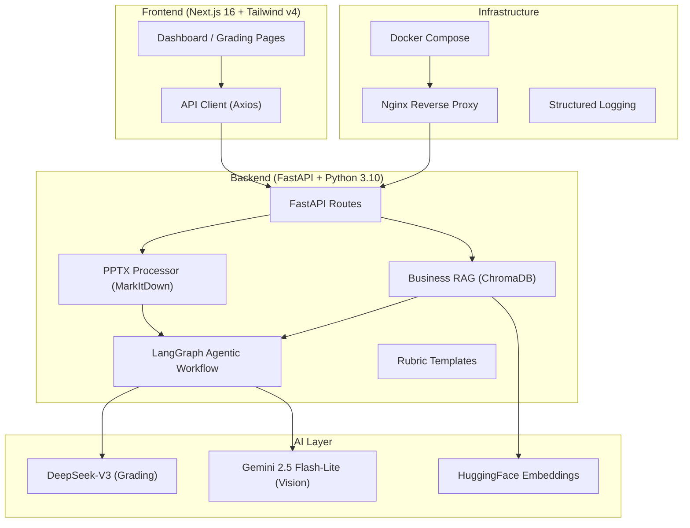

# GradeWise Business Plan Grader — Full Rebuild Proposal

> **From scratch to Startup V1 in 6 months** | 2 entry-level developers @ 40 hrs/week each

---

## 1. Executive Summary

This proposal outlines a complete rebuild of the **GradeWise Business Plan Grader** — an AI-powered system that evaluates business plan submissions (PPTX slide decks, PDFs, videos, Google Slides) using an agentic LangGraph workflow, DeepSeek-V3 LLM, ChromaDB RAG, and optional Gemini multimodal vision.

Based on a thorough scan of the existing codebase, this proposal preserves the proven architecture while rebuilding cleanly from scratch with production-grade patterns, proper test coverage, and a polished user experience.

### Scope at a Glance

| Dimension | MVP (Month 1–2) | V1 Startup (Month 3–6) |
|-----------|-----------------|------------------------|
| **Grading** | Single business plan (PPTX + PDF) | + YouTube video + Google Slides + mass grading |
| **AI** | DeepSeek-V3 with text-only grading | + Gemini 2.5 Flash-Lite multimodal vision |
| **RAG** | Basic business context retrieval | + Industry benchmarks, auto-ingestion |
| **Frontend** | Core grading UI + results display | + Analytics dashboard, history, batch UI |
| **Auth** | None (local use) | OAuth (Google/GitHub), user accounts |
| **Infra** | Local dev + basic Docker | Full Docker Compose, CI/CD, cloud deploy |
| **Tests** | Unit tests for core grading | + Integration, E2E, benchmark suite |

---

## 2. Technical Architecture (Inherited from Current Project)

### Tech Stack

| Layer | Technology | Version/Notes |
|-------|-----------|---------------|
| **Frontend** | Next.js 16 + React 19 | TypeScript, App Router |
| **Styling** | Tailwind CSS v4 + Framer Motion | Responsive, animations |
| **Backend** | FastAPI + Uvicorn | Python 3.10 |
| **Orchestration** | LangGraph | StateGraph, conditional edges |
| **LLM** | DeepSeek-V3 | via OpenAI-compatible API |
| **Vision (V1)** | Gemini 2.5 Flash-Lite | Multimodal video+image |
| **RAG** | ChromaDB + HuggingFace | all-MiniLM-L6-v2 embeddings |
| **PPTX** | Microsoft MarkItDown | PPTX → Markdown |
| **Database** | ChromaDB (vectors) + TBD (relational) | Separate business collection |
| **Container** | Docker + Docker Compose | Nginx gateway |

---

## 3. Team Structure & Role Assignments

### Team: 2 Entry-Level Developers

| Role | Person | Primary Responsibilities |
|------|--------|--------------------------|
| **Dev A (You)** | Lead / Full-Stack (Backend-leaning) | LangGraph agent, FastAPI routes, AI integration, system architecture, DevOps |
| **Dev B (Teammate)** | Full-Stack (Frontend-leaning) | Next.js pages, React components, API integration, UI/UX polish, testing |

### Skill Development Plan

Both developers are entry-level, so the project doubles as a learning experience:

| Week | Dev A Learns | Dev B Learns |
|------|-------------|-------------|
| 1–2 | LangGraph fundamentals, FastAPI patterns | Next.js App Router, Tailwind v4 |
| 3–4 | Prompt engineering, RAG pipelines | React state management, form handling |
| 5–6 | Gemini multimodal AI, video analysis | Component architecture, responsive design |
| 7–8 | API design, error handling patterns | Data visualization, batch UX |
| 9–12 | CI/CD, Docker, cloud deployment, auth | E2E testing, accessibility, database integration |
| 13–24 | System optimization, scaling, monitoring | Polish, animations, production UX, SDK docs |

---

## 4. Phase Breakdown

---

### 🏗️ Phase 1: Foundation & MVP Core (Weeks 1–4) — Month 1

**Goal:** Working business plan grader that accepts PPTX/PDF uploads, grades with AI, and shows results.

#### Week 1: Project Setup & Backend Foundation
*Combined: 80 hours (40 each)*

| Task | Assignee | Hours | Description |
|------|----------|-------|-------------|
| Project scaffolding | Dev A | 8 | Init Git repo, Python venv, folder structure, `.env`, `.gitignore` |
| FastAPI app skeleton | Dev A | 8 | App factory, CORS, lifespan, health endpoint, Uvicorn config |
| Data models (Pydantic + TypedDict) | Dev A | 8 | `RubricItem`, `GradeResult`, `AgentState`, `PPTXFile`, `BusinessPlanGradeRequest` |
| DeepSeek-V3 LLM setup | Dev A | 8 | LangChain OpenAI provider config, test connection, error handling |
| PPTX Processor module | Dev A | 8 | MarkItDown integration, `extract_to_markdown()`, `analyze_visual_density()` |
| Next.js project init | Dev B | 8 | Create Next.js app, Tailwind v4, Framer Motion, folder structure |
| Global styles & design system | Dev B | 10 | Color palette, typography, dark mode toggle, CSS variables |
| Sidebar navigation component | Dev B | 6 | `Sidebar.tsx` with routing, icons, collapse/expand |
| Dashboard layout shell | Dev B | 8 | `(dashboard)/layout.tsx`, responsive grid, mobile hamburger |
| API client module | Dev B | 8 | Axios instance, `api.ts` with typed methods for all endpoints |

> **Week 1 Totals:** Dev A = 40 hrs, Dev B = 40 hrs ✅

#### Week 2: Core Grading Pipeline + Basic UI
*Combined: 80 hours*

| Task | Assignee | Hours | Description |
|------|----------|-------|-------------|
| Business RAG module | Dev A | 10 | `business_rag.py` — ChromaDB collection, ingest, retrieve with type filtering |
| Business rubric templates | Dev A | 6 | `business_rubric_templates.py` — Startup, Enterprise, Nonprofit templates (7 criteria each) |
| Business agent workflow | Dev A | 16 | `business_agent.py` — 4 LangGraph nodes: `retrieve → grade → validate → feedback` |
| Business grading prompt | Dev A | 8 | VC Partner evaluation prompt with scoring rules, JSON output format |
| Business grading page UI | Dev B | 14 | `business-grading/page.tsx` — File upload (PPTX + PDF), business type selector, rubric editor |
| Grading loader animation | Dev B | 4 | `GradingLoader.tsx` — Animated loading state during grading |
| Results display component | Dev B | 8 | Markdown feedback rendering with `react-markdown`, score display, confidence indicator |
| PPTX upload component | Dev B | 6 | Drag-and-drop, file validation (.pptx only), metadata preview |
| Rubric upload/edit component | Dev B | 8 | Parse rubric files, manual editing, template loading |

> **Week 2 Totals:** Dev A = 40 hrs, Dev B = 40 hrs ✅

#### Week 3: API Routes, Integration & Context System
*Combined: 80 hours*

| Task | Assignee | Hours | Description |
|------|----------|-------|-------------|
| FastAPI endpoints | Dev A | 12 | `/grade-business-plan`, `/extract-pptx`, `/ingest-business-context`, `/business-rubric-template/{type}` |
| Business context starter pack | Dev A | 8 | Curate 5-6 benchmark docs (YC guides, financial ratios), auto-ingest on startup |
| Error handling & validation | Dev A | 8 | Input validation, structured error responses, HTTP 422 for invalid uploads |
| Rubric parser module | Dev A | 8 | `rubric_parser.py` — Parse PDF/DOCX/CSV/XLSX rubrics into structured `RubricItem[]` |
| Frontend-backend integration | Dev B | 16 | Wire all API calls, handle loading/error states, test end-to-end flow |
| Grade details modal | Dev B | 8 | Expandable modal showing full feedback, thinking process, citations |
| Context upload page | Dev B | 6 | Upload business context materials, category tagging |
| Responsive polish | Dev B | 6 | Mobile breakpoints for grading page, sidebar, results display |
| Bug fixes from integration | Dev A + Dev B | 4 + 4 | Resolve issues found during integration testing |

> **Week 3 Totals:** Dev A = 40 hrs, Dev B = 40 hrs ✅

#### Week 4: MVP Testing & Polish
*Combined: 80 hours*

| Task | Assignee | Hours | Description |
|------|----------|-------|-------------|
| Unit tests — backend | Dev A | 12 | Test PPTX processor, rubric parser, data models, RAG retrieval |
| Unit tests — agent nodes | Dev A | 10 | Test `grade_business_plan`, `validate_business_grade`, `generate_business_feedback` |
| Integration tests | Dev A | 8 | Test full grading pipeline end-to-end via API |
| Grading quality validation | Dev A | 6 | Grade 5 sample business plans, compare with expected scores |
| README + documentation | Dev A | 4 | Setup guide, API docs, architecture diagram |
| Frontend polish | Dev B | 14 | Micro-animations, hover effects, transitions, loading skeletons |
| Error state UIs | Dev B | 6 | Error boundaries, empty states, retry buttons, toast notifications |
| Landing page | Dev B | 12 | Hero section, features grid, CTA, footer |
| Bug fixes from testing | Dev B | 4 | Fix UI issues found during backend testing |
| MVP demo prep | Dev A + Dev B | — | 4 hours included in each dev's total |

> **Week 4 Totals:** Dev A = 40 hrs, Dev B = 40 hrs ✅
>
> **🏁 MVP Milestone Delivery: End of Week 4**

---

### 🚀 Phase 2: Enhanced Features (Weeks 5–8) — Month 2

**Goal:** Add Gemini multimodal (YouTube + Google Slides), improve grading quality, mass grading.

#### Week 5: Gemini Video Analyzer Module
*Combined: 80 hours*

| Task | Assignee | Hours | Description |
|------|----------|-------|-------------|
| Gemini API setup | Dev A | 6 | `google-genai` package, API key config, health check endpoint |
| Video analyzer module | Dev A | 14 | `video_analyzer.py` — YouTube URL analysis, uploaded video analysis, timeout + retry |
| Slides vision module | Dev A | 12 | Google Slides → PPTX download → image extraction → Gemini vision analysis |
| Fail-stop logic | Dev A | 8 | Link provided but analysis fails → halt grading with 422 + structured error |
| YouTube URL input UI | Dev B | 10 | URL input field with validation, YouTube thumbnail preview |
| Google Slides URL input UI | Dev B | 10 | URL input with validation, presentation ID extraction |
| Updated grading form | Dev B | 8 | Integrate video/slides inputs into business grading page |
| Error handling for 422 | Dev B | 6 | Parse structured 422 errors, show suggestions to user |
| Testing video features | Dev B | 6 | Test valid/invalid URLs, private videos, missing API key scenarios |

> **Week 5 Totals:** Dev A = 40 hrs, Dev B = 40 hrs ✅

#### Week 6: Grading Pipeline Enhancements
*Combined: 80 hours*

| Task | Assignee | Hours | Description |
|------|----------|-------|-------------|
| Inject video data into grading | Dev A | 10 | Update `business_agent.py` — Add video + slide vision to grading prompt |
| Update feedback generation | Dev A | 8 | Add 🎥 Presentation Analysis + 🎨 Slide Design sections to feedback |
| Structured logging module | Dev A | 10 | `grading_logger.py` — Per-request logging, request ID, stage tracking |
| Fix brace conversion bug | Dev A | 4 | Correct JSON corruption in prompt template processing |
| AgentState expansion | Dev A | 4 | Add `video_analysis`, `slide_vision_analysis`, `youtube_url`, `google_slides_url` |
| Cross-feature testing (backend) | Dev A | 4 | Full regression testing across all backend features |
| Presentation analysis display | Dev B | 10 | Show video delivery scores, content gaps, slide design quality in results |
| Grading history page | Dev B | 12 | `history/page.tsx` — List past grades, filter, sort, search |
| Local storage for grades | Dev B | 6 | Save grading results to localStorage, retrieve on history page |
| Notification system | Dev B | 8 | `NotificationDropdown.tsx` — In-app notifications for grading completion |
| Cross-feature testing (frontend) | Dev B | 4 | Full regression testing across all frontend features |

> **Week 6 Totals:** Dev A = 40 hrs, Dev B = 40 hrs ✅

#### Week 7: Mass Business Grading
*Combined: 80 hours*

| Task | Assignee | Hours | Description |
|------|----------|-------|-------------|
| Mass grading backend | Dev A | 14 | `POST /mass-grade-business` — Spreadsheet parsing, concurrent grading, semaphore |
| Spreadsheet parser | Dev A | 8 | CSV/XLSX parsing with column aliases, skip logic for incomplete rows |
| Concurrent grading engine | Dev A | 8 | `asyncio.Semaphore` for parallel processing (3 concurrent by default) |
| Mass grading API integration | Dev A | 6 | API client update, timeout configuration (10 min for batch) |
| Backend testing | Dev A | 4 | Unit + integration tests for mass grading |
| Mass grading frontend page | Dev B | 16 | `mass-business-grading/page.tsx` — Spreadsheet upload, preview table, progress tracking |
| Results dashboard UI | Dev B | 10 | Summary stats, color-coded scores, expandable feedback per row |
| CSV export button | Dev B | 4 | Download results as CSV (Name, Business, Score, Max, %, Status) |
| Skipped rows warning UI | Dev B | 4 | Yellow-highlighted rows with missing fields, reason display |
| End-to-end mass grading test | Dev B | 6 | Test with 5-10 row spreadsheet, verify concurrent execution |

> **Week 7 Totals:** Dev A = 40 hrs, Dev B = 40 hrs ✅

#### Week 8: Quality Assurance & Benchmarking
*Combined: 80 hours*

| Task | Assignee | Hours | Description |
|------|----------|-------|-------------|
| Benchmark test suite | Dev A | 10 | 10 sample business plans, human expert grades as ground truth |
| Grading correlation analysis | Dev A | 8 | Calculate score correlation with human grades (target: >0.75) |
| Prompt optimization | Dev A | 10 | Iterate on grading prompts based on benchmark results |
| Token usage tracking | Dev A | 6 | Log token counts, calculate cost per submission |
| Performance benchmarking | Dev A | 6 | Measure end-to-end grading time (target: <30s) |
| UI/UX audit & fixes | Dev B | 12 | Visual consistency, accessibility (ARIA), keyboard navigation |
| Loading states audit | Dev B | 6 | Ensure all async operations show proper loading indicators |
| Mobile responsiveness audit | Dev B | 8 | Test + fix all pages on mobile breakpoints |
| End-to-end test suite | Dev B | 8 | Full user flow testing: upload → grade → view results → download |
| Phase 2 demo prep | Dev B | 6 | Updated demo, changelog documentation |

> **Week 8 Totals:** Dev A = 40 hrs, Dev B = 40 hrs ✅
>
> **🏁 Enhanced MVP Milestone: End of Week 8**

---

### 💼 Phase 3: Production-Ready (Weeks 9–12) — Month 3

**Goal:** Authentication, database persistence, analytics, deployment pipeline.

#### Week 9: Authentication & User System
*Combined: 80 hours*

| Task | Assignee | Hours | Description |
|------|----------|-------|-------------|
| OAuth provider setup | Dev A | 8 | Google + GitHub OAuth via NextAuth.js or custom provider |
| Auth middleware (backend) | Dev A | 10 | JWT validation, protected route decorators, API key management |
| User model + storage | Dev A | 10 | User database schema (TBD — SQLite/PostgreSQL), session management |
| Role-based access control | Dev A | 6 | Admin vs Member roles, permission guards |
| Session persistence | Dev A | 6 | Remember me, refresh token rotation |
| Login/signup pages | Dev B | 12 | `login/page.tsx`, `signup/page.tsx` — OAuth buttons, email forms |
| Auth state management | Dev B | 10 | Context provider, token storage, auto-redirect, protected routes |
| User profile page | Dev B | 6 | `settings/page.tsx` — Profile editing, password change, API key display |
| Backguard component | Dev B | 4 | Prevent navigation away from unsaved changes |
| Auth flow testing | Dev B | 8 | Login/logout, token expiry, role-based routing, edge cases |

> **Week 9 Totals:** Dev A = 40 hrs, Dev B = 40 hrs ✅

#### Week 10: Database & Data Persistence
*Combined: 80 hours*

| Task | Assignee | Hours | Description |
|------|----------|-------|-------------|
| Database schema design | Dev A | 8 | Tables: users, rubrics, submissions, grades, grading_sessions |
| ORM setup (SQLAlchemy or Prisma) | Dev A | 10 | Models, migrations, connection pooling |
| Grade CRUD endpoints | Dev A | 10 | Save, retrieve, update, delete grades via API |
| Rubric persistence | Dev A | 8 | Save custom rubrics per user, share rubrics between users |
| Database migration scripts | Dev A | 4 | Alembic/Prisma migrations, seed data |
| Submission history integration | Dev B | 12 | Replace localStorage with database-backed history |
| Data tables & pagination | Dev B | 10 | Sortable, filterable tables for grades + submissions |
| Submission management page | Dev B | 10 | `submissions/page.tsx` — View all submissions, re-grade, delete |
| Data integrity tests | Dev B | 8 | CRUD operations, concurrent writes, cascade deletes |

> **Week 10 Totals:** Dev A = 40 hrs, Dev B = 40 hrs ✅

#### Week 11: Analytics Dashboard
*Combined: 80 hours*

| Task | Assignee | Hours | Description |
|------|----------|-------|-------------|
| Analytics API endpoints | Dev A | 12 | Aggregations: avg score, grade distribution, rubric breakdown, trends |
| Export functionality | Dev A | 10 | CSV/XLSX export for grades, analytics data, batch results |
| Report generation | Dev A | 10 | PDF report per submission with formatted feedback + scores |
| Analytics testing | Dev A | 8 | Verify calculations, edge cases (empty data, single submission) |
| Analytics dashboard page | Dev B | 14 | `analytics/page.tsx` — Charts, graphs, key metrics |
| Chart components | Dev B | 10 | Score distribution histogram, trend line, rubric radar chart |
| Filter/date range controls | Dev B | 6 | Filter analytics by date, business type, rubric template |
| Export UI + dashboard polish | Dev B | 10 | Download buttons for CSV/XLSX/PDF, glassmorphism cards, animations |

> **Week 11 Totals:** Dev A = 40 hrs, Dev B = 40 hrs ✅

#### Week 12: DevOps & Deployment Pipeline
*Combined: 80 hours*

| Task | Assignee | Hours | Description |
|------|----------|-------|-------------|
| Docker optimization | Dev A | 8 | Multi-stage builds, layer caching, image size reduction |
| Docker Compose production | Dev A | 6 | Environment-specific configs, secrets management |
| CI/CD pipeline | Dev A | 8 | GitHub Actions: lint → test → build → deploy |
| Cloud deployment | Dev A | 8 | AWS EC2 or Render deployment, DNS + SSL setup |
| Nginx production config | Dev A | 6 | Proxy timeouts, rate limiting, security headers |
| Smoke tests (deployed) | Dev A | 4 | Verify all features on deployed instance |
| Environment management | Dev B | 6 | `.env.production`, `.env.development`, feature flags |
| Health monitoring page | Dev B | 8 | System status: API health, Gemini health, DB connection status |
| Deployment documentation | Dev B | 8 | Deployment guide, runbook, troubleshooting guide |
| Load testing | Dev B | 10 | Simulate 10 concurrent grading requests, measure response times |
| Phase 3 demo prep | Dev B | 8 | Updated demo, deployment walkthrough |

> **Week 12 Totals:** Dev A = 40 hrs, Dev B = 40 hrs ✅
>
> **🏁 Deployed Beta Milestone: End of Week 12**

---

### 🎯 Phase 4: Polish, Scale & V1 Launch (Weeks 13–24) — Months 4–6

#### Week 13–14: Advanced Grading Features
*Combined: 160 hours (80/week)*

| Task | Assignee | Hours | Description |
|------|----------|-------|-------------|
| Grading feedback chat | Dev A | 16 | RAG-powered chat for discussing and refining grading feedback |
| Rubric comparison tool | Dev A | 12 | Compare grading results across different rubric templates |
| Custom prompt templates | Dev A | 12 | Allow users to customize grading persona and evaluation style |
| Grading calibration tool | Dev A | 10 | Grade same submission multiple times, show consistency metrics |
| Integration testing | Dev A | 20 | Full feature regression across all new backend features |
| Chat UI component | Dev B | 16 | Chat interface with message bubbles, typing indicator, sources |
| Rubric comparison view | Dev B | 12 | Side-by-side rubric comparison, diff highlighting |
| Prompt template editor | Dev B | 12 | Rich text editor for custom prompts, preview mode |
| Settings page expansion | Dev B | 10 | API keys, notification preferences, grading defaults |
| Documentation updates | Dev A + Dev B | 10 + 10 | User guide, API documentation updates |
| Frontend integration testing | Dev B | 20 | Full feature regression across all frontend features |

> **Week 13–14 Totals:** Dev A = 80 hrs, Dev B = 80 hrs ✅

#### Week 15–16: Performance & Security Hardening
*Combined: 160 hours (80/week)*

| Task | Assignee | Hours | Description |
|------|----------|-------|-------------|
| Caching layer | Dev A | 12 | Redis or in-memory cache for RAG queries, rubric templates |
| Rate limiting | Dev A | 8 | Per-user rate limits on grading endpoints |
| Input sanitization | Dev A | 8 | File upload security (size limits, type validation, malware scan) |
| API versioning | Dev A | 6 | `/api/v1/` prefix, backward compatibility |
| Background job queue | Dev A | 10 | Celery or FastAPI background tasks for long-running grades |
| Error monitoring setup | Dev A | 8 | Sentry or equivalent, error tracking, alerting |
| Security audit | Dev A | 8 | OWASP checklist, dependency scanning, secret rotation |
| Performance testing (backend) | Dev A | 8 | API benchmarks, database query optimization |
| Bug fixes (backend) | Dev A | 12 | Fix prioritized bugs from testing |
| Frontend performance | Dev B | 14 | Code splitting, lazy loading, image optimization |
| SEO optimization | Dev B | 8 | Meta tags, Open Graph, sitemap, structured data |
| Accessibility audit | Dev B | 10 | WCAG 2.1 AA compliance, screen reader testing |
| Security hardening (frontend) | Dev B | 8 | XSS prevention, CSP headers, input validation |
| Performance testing (frontend) | Dev B | 12 | Lighthouse scores, responsive testing, load times |
| Bug bash & fixes (frontend) | Dev B | 14 | Team-wide bug finding session, prioritize and fix |
| Cross-browser testing | Dev B | 14 | Test + fix across Chrome, Firefox, Safari, Edge |

> **Week 15–16 Totals:** Dev A = 80 hrs, Dev B = 80 hrs ✅

#### Week 17–20: Public API, Integrations & Scaling
*Combined: 320 hours (80/week)*

| Task | Assignee | Hours | Description |
|------|----------|-------|-------------|
| Public REST API | Dev A | 20 | API key auth, versioned endpoints, rate limiting per key |
| Webhook system | Dev A | 16 | Webhook notifications on grade completion, configurable endpoints |
| Notification service | Dev A | 14 | Email notifications (grading complete), webhook dispatch |
| Bulk grading API | Dev A | 14 | Programmatic batch submission via API (JSON + file upload) |
| SDK starter kit | Dev A | 10 | Python + JS SDK for API consumers |
| Data migration scripts | Dev A | 8 | Multi-workspace data model migration |
| API integration testing | Dev A | 14 | Test API auth, webhooks, rate limiting, concurrent usage |
| API & SDK documentation | Dev A | 10 | Comprehensive API guide with code examples |
| Cost optimization | Dev A | 10 | Prompt compression, token usage reduction, caching tuning |
| Usage analytics | Dev A | 10 | Track feature usage, popular rubrics, grading volume |
| Remaining buffer (Dev A) | Dev A | 34 | Overflow, bug fixes, unforeseen tasks |
| API documentation portal | Dev B | 16 | Interactive API docs (Swagger/ReDoc), code examples |
| Webhook management UI | Dev B | 14 | Configure webhook URLs, view delivery logs, retry failed |
| Team/workspace system | Dev B | 16 | Create workspaces, invite team members, shared rubrics |
| Notification preferences UI | Dev B | 10 | Email preferences, in-app notification settings |
| Workspace UI polish | Dev B | 12 | Workspace switching, member management, invitations |
| Frontend integration testing | Dev B | 12 | End-to-end testing across all new UI features |
| Integration guide docs | Dev B | 10 | Integration guide, workspace admin guide |
| Remaining buffer (Dev B) | Dev B | 70 | Overflow, bug fixes, unforeseen tasks |

> **Week 17–20 Totals:** Dev A = 160 hrs, Dev B = 160 hrs ✅

#### Week 21–24: Final Polish & V1 Launch
*Combined: 320 hours (80/week)*

| Task | Assignee | Hours | Description |
|------|----------|-------|-------------|
| Landing page redesign | Dev B | 16 | Enterprise-ready landing with testimonials, pricing, demo video |
| Onboarding flow | Dev B | 12 | First-time user tutorial, sample rubric, demo submission |
| Email template design | Dev B | 10 | Transactional emails (welcome, grade complete, password reset) |
| Infrastructure scaling | Dev A | 12 | Auto-scaling config, database connection pooling, CDN setup |
| Load testing (production) | Dev A | 10 | 50 concurrent users, 100 concurrent grading requests |
| Full regression test suite | Dev A + Dev B | 10 + 10 | Automated E2E tests, manual QA checklist |
| Beta user feedback | Dev A + Dev B | 8 + 8 | Collect and address feedback from 5-10 beta users |
| Bug fixes & polish | Dev A + Dev B | 16 + 16 | Address all P0/P1 bugs from testing and feedback |
| V1 launch preparation | Dev A + Dev B | 6 + 6 | Release notes, marketing page, product hunt prep |
| Final documentation | Dev A + Dev B | 8 + 8 | Complete user guide, admin guide, developer docs |
| Launch monitoring | Dev A + Dev B | 6 + 6 | First 48 hours monitoring, rapid bug fixes |
| Post-launch retrospective | Dev A + Dev B | 4 + 4 | Document lessons learned, V1.1 roadmap |
| Final cost audit | Dev A | 10 | Review API costs, optimize token usage, set budget alerts |
| Final UX audit | Dev B | 14 | End-to-end UX review, animation polish, consistency |
| Remaining buffer (Dev A) | Dev A | 70 | Overflow, unforeseen tasks, client feedback |
| Remaining buffer (Dev B) | Dev B | 50 | Overflow, unforeseen tasks, client feedback |

> **Week 21–24 Totals:** Dev A = 160 hrs, Dev B = 160 hrs ✅
>
> **🏁 V1 Startup Launch: End of Week 24**

---

## 5. Hours Summary

### By Phase

| Phase | Duration | Total Hours | Dev A | Dev B |
|-------|----------|-------------|-------|-------|
| **Phase 1: MVP Core** | Weeks 1–4 | 320 hrs | 160 hrs | 160 hrs |
| **Phase 2: Enhanced Features** | Weeks 5–8 | 320 hrs | 160 hrs | 160 hrs |
| **Phase 3: Production-Ready** | Weeks 9–12 | 320 hrs | 160 hrs | 160 hrs |
| **Phase 4: Polish & Launch** | Weeks 13–24 | 960 hrs | 480 hrs | 480 hrs |
| **TOTAL** | **24 weeks** | **1,920 hrs** | **960 hrs** | **960 hrs** |

### By Role/Function

| Category | Hours | % of Total |
|----------|-------|------------|
| **Backend Development** | 440 hrs | 23% |
| **Frontend Development** | 460 hrs | 24% |
| **AI/ML (Prompts, LangGraph, RAG)** | 180 hrs | 9% |
| **Testing & QA** | 240 hrs | 13% |
| **DevOps & Infrastructure** | 130 hrs | 7% |
| **Documentation** | 110 hrs | 6% |
| **Design & UX Polish** | 136 hrs | 7% |
| **Buffer (Overflow/Client Feedback)** | 224 hrs | 11% |
| **TOTAL** | **1,920 hrs** | **100%** |

---

## 6. Cost Estimation

### Development Costs

| Item | Rate | Total |
|------|------|-------|
| Dev A (You) — 960 hrs | $0 (founder/equity) | $0 |
| Dev B (Teammate) — 960 hrs | $0 (founder/equity) | $0 |
| **Opportunity cost (market rate reference)** | $30–50/hr × 1,920 hrs | $57,600–96,000 |

### Infrastructure & Services

| Item | Monthly Cost | 6-Month Total | Notes |
|------|-------------|---------------|-------|
| **DeepSeek-V3 API** | $5–20 | $30–120 | ~$0.003–0.006/submission |
| **Gemini 2.5 Flash-Lite** | $5–20 | $30–120 | ~$0.015/submission (from Month 2) |
| **Cloud Hosting (AWS EC2 / Render)** | $0–25 | $0–150 | Free tier → small instance |
| **Domain Name** | ~$1/mo | ~$12 | `.com` or `.app` |
| **SSL Certificate** | $0 | $0 | Let's Encrypt |
| **GitHub** | $0 | $0 | Free tier sufficient |
| **Sentry (Error Monitoring)** | $0 | $0 | Free tier for dev |
| **Total Infrastructure** | **$11–66/mo** | **$72–402** | |

### Per-Submission Cost (Production)

Based on current API pricing (Feb 2026):

| Component | Est. Tokens | Pricing | Cost/Submission |
|-----------|------------|---------|-----------------|
| DeepSeek-V3 input (cache miss) | ~12K | $0.28/M tokens | $0.00336 |
| DeepSeek-V3 output | ~6K | $0.42/M tokens | $0.00252 |
| DeepSeek-V3 input (cache hit) | ~12K | $0.028/M tokens | $0.00034 |
| **DeepSeek subtotal** | **~18K** | — | **$0.003–$0.006** |
| Gemini Flash-Lite input (video+slides) | ~100K | $0.10/M tokens | $0.01000 |
| Gemini Flash-Lite output | ~16K | $0.40/M tokens | $0.00640 |
| **Gemini subtotal** | **~116K** | — | **~$0.016** |
| HuggingFace Embeddings | — | — | $0 (local) |
| **Total per submission (text-only)** | — | — | **$0.003–$0.006** |
| **Total per submission (with video+vision)** | — | — | **$0.019–$0.022** |

| Volume (Monthly) | Text-Only | With Video+Vision |
|-------------------|-----------|-------------------|
| 100 submissions | $0.30–$0.60 | $1.90–$2.20 |
| 500 submissions | $1.50–$3.00 | $9.50–$11.00 |
| 1,000 submissions | $3.00–$6.00 | $19.00–$22.00 |

### Total Project Budget

| Category | Low Estimate | High Estimate |
|----------|-------------|--------------|
| Developer salaries | $0 (equity) | $0 (equity) |
| Infrastructure (6 months) | $72 | $402 |
| AI API costs (6 months) | $60 | $240 |
| Tools & services | $0 | $0 |
| **TOTAL CASH OUTLAY** | **$132** | **$642** |

---

## 7. Key Milestones & Deliverables

| Milestone | Week | Deliverables |
|----------|------|-------------|
| **🏗️ MVP Alpha** | Week 4 | Functional grading: PPTX/PDF upload → AI grade → results display |
| **🧪 MVP Beta** | Week 8 | + YouTube/Slides input, mass grading, benchmark-validated quality |
| **🔐 Auth Release** | Week 10 | + User accounts, database persistence, data management |
| **📊 Analytics Release** | Week 11 | + Analytics dashboard, export functionality |
| **🚀 Deployed Beta** | Week 12 | Live on cloud, CI/CD pipeline, monitoring |
| **💬 Full Features** | Week 16 | + Chat, performance optimization, security hardening |
| **🔌 API & Integrations** | Week 20 | + Public API, webhooks, team workspaces, SDK |
| **🎯 V1 Launch** | Week 24 | Production-ready startup product |

---

## 8. Risk Register

| Risk | Probability | Impact | Mitigation |
|------|------------|--------|------------|
| Grading quality too low (<0.6 correlation) | Medium | High | Iterative prompt refinement, few-shot examples, benchmark suite |
| DeepSeek API downtime | Low | High | Add fallback LLM (Groq/Gemini), retry logic, circuit breaker |
| Gemini API cost overrun | Low | Medium | File size guards, selective vision processing, budget alerts |
| PPTX parsing failures | Medium | Medium | Robust error handling, fallback to text-only, user error messages |
| Scope creep | High | High | Strict MVP scope, weekly sprint reviews, defer V2 features |
| Entry-level skill gaps | High | Medium | Structured learning plan, code reviews, pair programming sessions |
| Security vulnerabilities | Medium | High | OWASP checklist, dependency scanning, security audit at Week 15 |
| Burnout (40 hrs/week for 6 months) | Medium | High | Regular breaks, celebrate milestones, flexible scheduling |

---

## 9. Files Inventory (What You're Building from Scratch)

### Backend Files (~15 files)

| File | Phase | Description |
|------|-------|-------------|
| `backend/src/main.py` | 1 | FastAPI app, all endpoints |
| `backend/src/models.py` | 1 | Pydantic models + AgentState |
| `backend/src/business_agent.py` | 1 | LangGraph 4-node business grading workflow |
| `backend/src/pptx_processor.py` | 1 | MarkItDown PPTX → Markdown |
| `backend/src/business_rag.py` | 1 | ChromaDB business context RAG |
| `backend/src/business_rubric_templates.py` | 1 | Startup/Enterprise/Nonprofit rubric templates |
| `backend/src/rubric_parser.py` | 1 | Parse rubric files into structured format |
| `backend/src/video_analyzer.py` | 2 | Gemini video + slides analysis |
| `backend/src/grading_logger.py` | 2 | Structured pipeline logging |
| `backend/src/auth.py` | 3 | Authentication middleware |
| `backend/src/database.py` | 3 | Database connection, ORM |
| `backend/src/user_model.py` | 3 | User CRUD operations |
| `backend/Dockerfile` | 3 | Production Docker image |
| `backend/tests/` | 1–4 | Test files |
| `requirements.txt` | 1 | Python dependencies |

### Frontend Files (~23 files)

| File | Phase | Description |
|------|-------|-------------|
| `frontend/app/layout.tsx` | 1 | Root layout with theme provider |
| `frontend/app/page.tsx` | 1 | Landing page |
| `frontend/app/(dashboard)/layout.tsx` | 1 | Dashboard layout with sidebar |
| `frontend/app/(dashboard)/business-grading/page.tsx` | 1 | Core grading page |
| `frontend/app/(dashboard)/dashboard/page.tsx` | 2 | Overview dashboard |
| `frontend/app/(dashboard)/history/page.tsx` | 2 | Grading history |
| `frontend/app/(dashboard)/mass-business-grading/page.tsx` | 2 | Mass grading page |
| `frontend/app/(dashboard)/analytics/page.tsx` | 3 | Analytics dashboard |
| `frontend/app/(dashboard)/settings/page.tsx` | 3 | User settings |
| `frontend/app/(dashboard)/submissions/page.tsx` | 3 | Submission management |
| `frontend/app/(dashboard)/workspaces/page.tsx` | 4 | Team workspace management |
| `frontend/app/login/page.tsx` | 3 | Login page |
| `frontend/app/signup/page.tsx` | 3 | Signup page |
| `frontend/components/Sidebar.tsx` | 1 | Navigation sidebar |
| `frontend/components/WebhookManager.tsx` | 4 | Webhook configuration UI |
| `frontend/components/GradingLoader.tsx` | 1 | Loading animation |
| `frontend/components/GradeDetailsModal.tsx` | 1 | Results modal |
| `frontend/components/NotificationDropdown.tsx` | 2 | Notifications |
| `frontend/components/Logo.tsx` | 1 | Logo component |
| `frontend/components/ModeToggle.tsx` | 1 | Dark mode toggle |
| `frontend/components/BackGuard.tsx` | 3 | Unsaved changes guard |
| `frontend/lib/api.ts` | 1 | API client |
| `frontend/app/globals.css` | 1 | Global styles |

### Infrastructure Files (~5 files)

| File | Phase | Description |
|------|-------|-------------|
| `docker-compose.yml` | 3 | Service orchestration |
| `nginx/nginx.conf` | 3 | Reverse proxy config |
| `.env` / `.env.example` | 1 | Environment variables |
| `.github/workflows/ci.yml` | 3 | CI/CD pipeline |
| `Makefile` | 1 | Common commands |

---

## 10. Weekly Checklist (Quick Reference)

### Month 1 (MVP)
- [  ] **Week 1:** Project setup, data models, LLM connection, frontend shell
- [  ] **Week 2:** Grading pipeline (4 LangGraph nodes), grading UI, rubric templates
- [  ] **Week 3:** API endpoints, RAG context, frontend-backend integration
- [  ] **Week 4:** Unit tests, quality validation, polish, MVP demo ✅

### Month 2 (Enhanced MVP)
- [  ] **Week 5:** Gemini video/slides analyzer, URL input UI
- [  ] **Week 6:** Video data in grading, logging, history page, bug fixes
- [  ] **Week 7:** Mass grading (backend + frontend), spreadsheet parsing
- [  ] **Week 8:** Benchmarking, quality audit, UX polish ✅

### Month 3 (Production)
- [  ] **Week 9:** OAuth authentication, login/signup, user accounts
- [  ] **Week 10:** Database persistence, grade CRUD, submission management
- [  ] **Week 11:** Analytics dashboard, charts, export functionality
- [  ] **Week 12:** Docker optimization, CI/CD, cloud deployment ✅

### Month 4 (Advanced Features)
- [  ] **Week 13–14:** Feedback chat, custom prompts, rubric comparison
- [  ] **Week 15–16:** Caching, rate limiting, security hardening, performance ✅

### Months 5–6 (Scale & Launch)
- [  ] **Week 17–20:** Public API, webhooks, team workspaces, SDK
- [  ] **Week 21–24:** Final polish, beta testing, V1 launch ✅

---

> **Bottom Line:** 6 months, 2 developers, ~$132–642 cash, 1,920 total hours → Production-ready business plan grading SaaS product.
